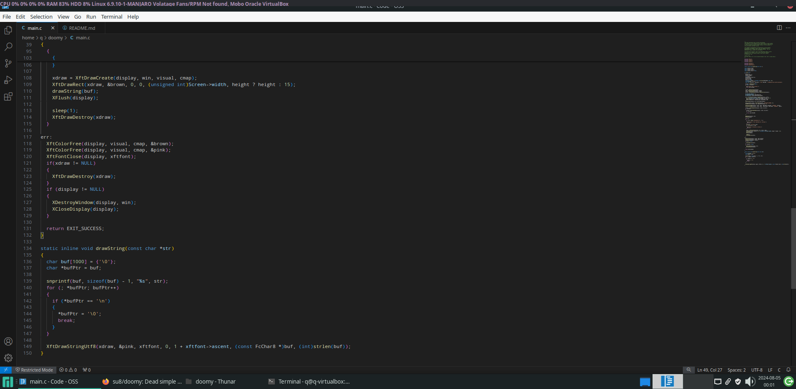

[](https://github.com/su8/doomy/actions/workflows/c-cpp.yml)



# doomy

Dead simple X11 bar for use with scripts in a loop

# Compile

```makefile
# The font size must be 6 pixel less than the bar height. The default bar height is 15 pixels.
# make BG_COLOR="#282a2e" TEXT_COLOR="#b294bb" USE_FONT="DejaVu Sans:size=9" -j8 # where 8 are your CPU cores.
# if you don't specify BG and TEXT colors the above line will be used by doomy, including the font too.
make -j8 # where 8 are CPU cores.
sudo make install
```

# Usage

The script below comes with this repository.

```bash
while true;
do
  uname -a
done | doomy & # will run in the background
```
